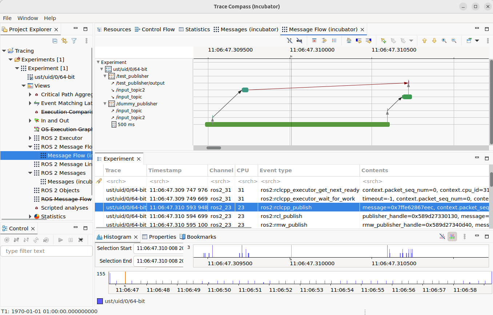

# Trace complex N-to-M ROS 2 message flows with Eclipse Trace Compass

>This work is based on https://github.com/christophebedard/ros2-message-flow-analysis and was updated to ROS 2 jazzy. The purpose of this repository is to easily demonstrate the function of the corresponding Pull Request in [ros2_tracing](github.com/ros2/ros2_tracing).

1. Clone this repository recursively and check out the branch with modifications for message flow tracing:

    ```bash
    git clone --recursive https://github.com/RaphvK/ros2_tracing.git
    cd ros2_tracing && git checkout message-flow
    ```

2. Install required ROS dependencies and build the packages in a ROS workspace, e.g. in a Docker container:

    ```bash
    docker run --rm -it -v $(pwd):/workspaces/src ros:jazzy
    ```

3. Execute the following command in the Docker container to setup the ROS workspace:

    ```bash
    # install dependencies
    apt update && rosdep update
    cd /workspaces
    rosdep install -i --from-paths src -y

    # build and source the ROS packages
    source /opt/ros/jazzy/setup.bash
    colcon build
    source install/setup.bash
    ```

4. Run the nodes to produce trace data:

    ```bash
    ros2 launch test_publisher test_publisher_launch.py
    ```

    Once the node is running, start recording a snapshot with:

    ```bash
    ros2 trace record_snapshot trace
    # wait for a few messages being sent and received and stop tracing afterwards
    ros2 trace stop trace
    ```

    Move recorded trace data into mounted folder:

    ```bash
    mv ~/.ros/tracing /workspaces/src/traces/
    ```

5. Analyze the recorded trace data either with the Jupyter notebooks provided in `tracetools_analysis` or with Eclipse Trace Compass.

### Statistical Analysis with Jupyter Notebook

1. Make sure to use a Jupyter server running in a terminal where the ROS workspace is sourced:

    ```bash
    cd /workspaces
    source install/setup.bash
    jupyter notebook
    ```

2. Open the Jupyter notebook at [./tracetools_analysis/tracetools_analysis/analysis/message_flow.ipynb](./tracetools_analysis/tracetools_analysis/analysis/message_flow.ipynb)

3. Run all cells and inspect the diagrams:

    - Message flow duration over time
    - Histogram of message flow durations

### Graphical Analysis with Eclipse Trace Compass

1. On your host, install and start [Eclipse Trace Compass (with Incubator plugins)](https://eclipse.dev/tracecompass/)

    ```bash
    wget https://download.eclipse.org/tracecompass.incubator/stable-11.2/rcp/trace-compass-0.16.0-20251127-1956-linux.gtk.x86_64.tar.gz
    tar -xzf trace-compass-*-linux.gtk.x86_64.tar.gz
    rm trace-compass-*-linux.gtk.x86_64.tar.gz

    cd trace-compass
    ./tracecompass
    ```

2. Import the trace data and inspect the message flow:
  
    1. File --> Import ... --> Select root directory: **ros2-message-flow-test/traces** --> Check the trace folder in the list --> Finish
    2. Right-Click on "Traces" in the Project Explorer --> Open As Experiment --> ROS 2 Expermient (Incubator)
    3. Open Experiments --> trace-* --> Views --> ROS 2 Messages --> Right click on "Messages (incubator)" --> Open
    4. Inspect the message flow, hold CTRL and scroll to zoom in, hold Shift to scroll left/right. Click an one of the bars in the line of the "500 ms" timer, then click the "Follow this element" button above the graph to analyze the message flow.
    5. Open Experiments --> trace-* --> Views --> ROS 2 Message Flow --> Right click on "Message Flow (incubator)" --> Open
    6. You should see the message flow, where the red arrow from `/test_publisher/input_topic2` to `/test_publisher/output` is only visibile due to the [`TRACEPOINT()` in the source code](./test_publisher/src/test_publisher.cpp) that defines this dependency.


